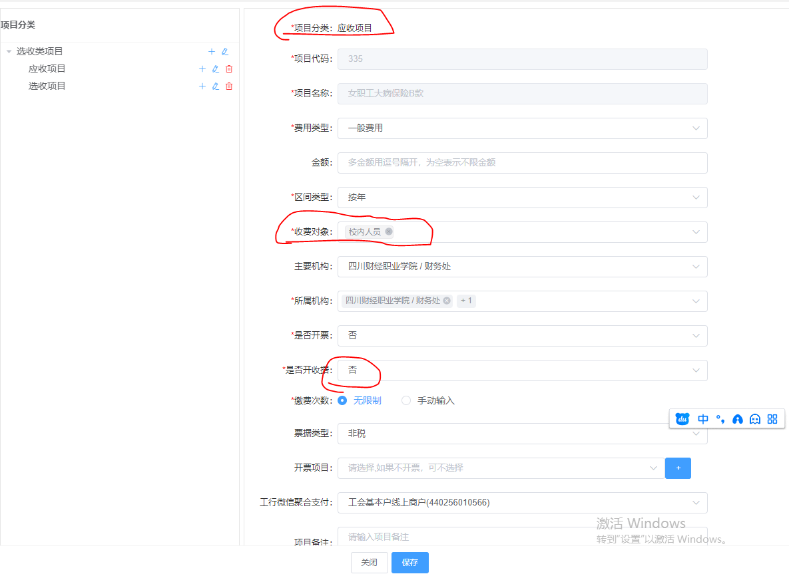
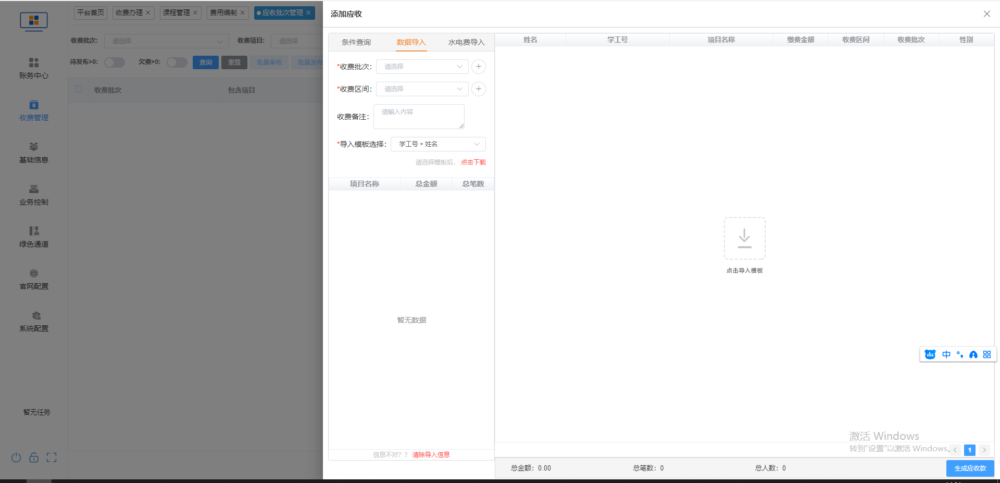

# 7月
让工行印刷“充值缴费平台”的指南。一般比新一届学生多几百份备用

# 8月末（新学年开学前）
### 绿色通道助学贷款申请审批
* 最好每天晚上审批一下，因为学生可能会去跟领导说“昨天我提交了今天还没审批”，即使他是昨晚上10点钟才提交的
* 如果是公众号流程的截图，到“银行审批”环节（第二个环节）就可以通过，因为只要资助中心审过了银行审批一般都能过
* 审核缓缴申请的时候，对老生严格一点，对新生可以稍微宽松一点。因为新生不通过缓缴申请会影响他们的报到

### 绿色通道缓交/缓缴申请审批
* 缓缴 只接受两种情况：退伍(只缓学费) 或 有学校缓缴申请表。如果不是这两种情况，请学生联系辅导员申请【缓缴申请表，如果是新生，最后两项“财务处意见”和“学工分管校领导审批”可以先不用填；不然，就需要整个表都签完我们才签。最后，缓缴申请表我要留一份备查】
* 医保我们这边无权给缓，实在要缓缴医保，需要上面同意

### 天财系统、网上收费系统 新生导入
* 天财，有导入模板【对照表可以通过 天财系统->代码设置 里下载】【第一次导入，导入的时候新生们的状态设置的是5（临时），所以过后批量修改他们学号的时候要把这里变成“在学”】
* 

# 9月
* 做留学生的批量减免

# 月末修改收费单日期
每到跨月的时候，因为是T+1录入，所以X月31号的单子，手工录入的话会是(X+1)月1号，这不利于核算统计。所以要手工给罗老师改收费单录入的日期到X月31号。

# 休学后复学：
1. 先看学生是否需要调班（降班级），需要先改班级和学生状态（休学->在学）
2. 再看钱的问题。先正常录入学费，然后看之前是否交了钱，如果之前多交了（或者说提前交了），再做减免单（因为老人老办法，所以学费对他来说都一个价，所以这个具体减免的哪一年不重要）；如果是退伍退役学生，因为退伍有学费减免，就要看他已缴费的支付方式，如果就是“工行聚合支付”那个就是他自己交的，就照章办事；如果是其他的（代表教育厅给的），那就xxx

# 退费【交了钱做减免单+退费单，还没交只做减免单。因为如果在系统里不做减免直接退费，那就变成学生又欠学校的了】【退费单打印第3种格式的】
* 学生退费，往往就是又贷了助学贷款，交学费的时候又自己交了。所以有退费单来，就需要我们再核实一遍。我们就找到这个学生（天财快速查询界面里），看他/她的缴费记录的缴费方式和金额
* 开学过后有学生交了学费，又决定退学（比如回去复读的），也需要给他们退费。先在天财里找到该学生，把状态改为退学，然后确认一下他是不是交了钱的，最后进行“退费录入”【进行退费录入之前要把其“应收款”改没，不然改不了】，且打印下来签个字。
### 退学的学生，要在教务系统“学籍异动审核”的时候写一个“已退学登记，若涉及退费，请联系财务处”，学生能看见，是我们的免责声明！！！！

# 退伍退役军人【给免3年学费】【表I表II都是一式两份】【财务处办完后下一站去武装保卫部】
### 表I是退费（表I，查已缴费否）
退伍军人拿表I来，是为了让我们财务复核签字，所以我们目的就是查看他的缴费记录，然后给签字找领导盖章。如果有助学贷款，助学贷那里就不填【表I里的实缴，和应缴的金额保持一致。不要问为什么，学工部那边说的这么填。反正表一的时间和表二的学费减免年数加起来等于3年就行】
### 表II是减免（表II，查复学后还要交多少）【只查，不做减免，每年年末等着学工部吴琳把“退役复学学费减免明细表”发过来后统一做。有要退费的学生也不例外】
3月入伍的，就算0.5年

### 办表全流程：
* 表I：退伍学生填表I申请->财务处确认学生缴费情况->学生办完表后把表交到学工，学工上交->财政把费用返给学校，学校退给学生
* 表II：退伍学生填表II申请->财务处确认学生缴费情况->学生办完表后把表交到学工，学工上交->财政每年统计确认一次退役学生学费减免情况，并将费用返给学校，学校上交

# 学籍异动处理（审核）【对我们而言，过我们这一关的目的是“把这个学生在系统里的状态改成 休学/退学 等”】
财院官网->智慧校园->业务直通车->教务系统->角色切换财务处->学籍管理->学籍异动管理

# 公务卡办理
1. 填一张硬卡纸单上面的承诺语句
2. 填一张白纸信息表（到时候工行帮忙把信息誊过硬卡纸单上去）
3. 拍一张身份证照片
4. 和办公室任意一位老师照一张合影

# 网上收费系统——学生学号（或其他信息）修改
* 基础信息->批量导入（没错，就是导入）。先下载模板，然后尽量简化要上传的东西。接下来，以修改学工号为例，导入模式选择“只做修改”，修改模式“身份证号+姓名”【这个修改模式是where的条件】。
* 上一步中，可能会有导入失败的学生。如果原因是“存在多个相同身份证号的学生”，那就需要“合并人员”（这种情况往往是因为上一年他来报到了退学了，今年又考的这个学校）。所以合并的时候，点选最新的学号以作为合并的master（因为为了明确他的真实入学年份嘛）

# 收费系统新增收费项目
* 收费管理->项目管理【“收费对象”栏有个bug，校内人员和校外人员都要选上【这一项只在选“二维码”时才有这个bug】；“主要机构”都只选财务处，“所属机构”要把财务处和举办机构选上，不然举办机构的人在系统上看不见】
* 对于“职工保险费”这种只针对校内的人收取的费用，有如下几个需要注意一下的事项，然后又在“应收批次管理”里像重修费导入一样做

* 当有人需要“缴费情况”之类的东西的时候，请在“收费管理->明细流水查询->缴费明细”中导出，不然你导出全量的时候，有的人看不懂Excel，也不会筛，，，，，

# 学生的交费情况
收费项目报表 -> 个人交费状况表

# 重修费导入

先还是建个收费项目，然后在上图这个界面里导入

# 党费收费录入
1. 如果有新党员，就先在“收费管理->党员收费->党员信息维护”里单个添加（赵老师说的批量添加不好用，我也难得试了）
2. 建立收费项目（“所属机构”除了财务处，还要选上所有“党组织机构”，就是说要让管党务的老师那边看到。其他和其他收费项目的建立一样）
3. “收费管理->党员收费->党员费用编制->批量导入”
4. 审核发布（the same as...）

# 财务入账金额核对
先在天财系统里看，如果天财的金额比核算给你的单子金额少，那就去 网上收费系统->收费管理->统计分析报表->项目收费汇总报表 再看。这里是非在线学生学费的那些费用，比如什么新会计法培训班收费啊会议费啊等等

# 退费申请表
我要在“财务处”的“经办审核意见”签“已交清xxx学年度费用”。最后分管校领导同意了以后，这张单子又拿回来给我，我做减免单退费单，把退费单打出来给杨老师

# 流程管理系统
通过easyconnect登上去。有事就找微信群里那几个标注好的老师

# 用友网上报账系统
通过easyconnect登上去。

# 高校非税票据一体化系统
1. 数据上报。每季度上报一次（其实就是三个月，没有说一定要季度末，反正3、6、9、12月各来一次），票据管理->票据审验->数据上报，右边“操作”里面第一个按钮上报即可
2. 票据申领。每年申领一次（）
3. 学生要打发票：归档管理->电子票据归档检索

# 改银行卡号
只改工资系统【学校官网进去的“工资查询”】，不改流程系统。因为流程系统的银行卡这些属性压根就没在用

# 退费结转
适用场景：之前有工作人员把学生缴费的项目录入错了（比如学生交住宿费750，学费没交，他把这750录入到了学费去，等于现在系统里显示这个学生学费没交够、住宿费没交）。这种情况我们需要做“退费结转”，操作为：菜单栏的收费业务->退费结转处理->然后把“收费项目”中收到的钱转到“结转项目”即可，“选择结转交费方式”选“13/它期结转”。

# 每个月月末，统计本学年度学生欠费名单！

# 若需要与各学院联系
* 财税学院 找 陈璐书记
* 金融学院 找 董中垒院长
* 会计学院 找 郑代富书记
* 信息学院 找 杨晓荣书记
* 工商管理学院 找 陈世平院长

# 合同各种流程
1. 签合同：办公系统->合同会签
2. 采购流程：
3. 付款：